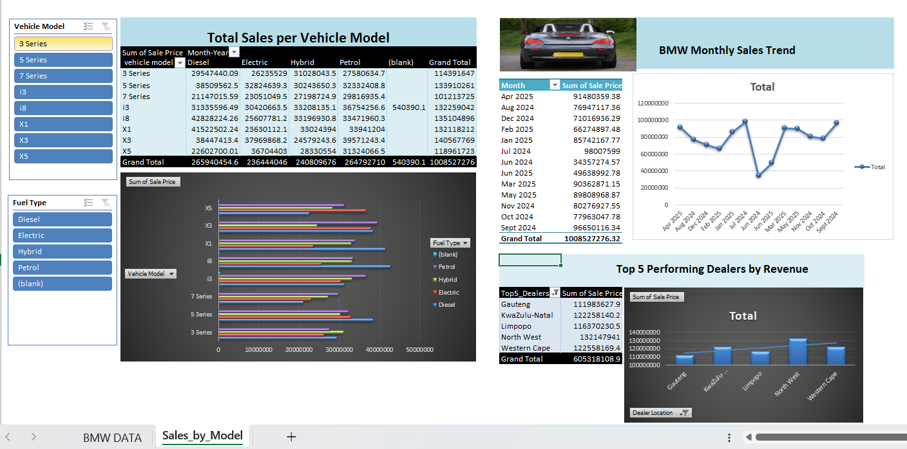
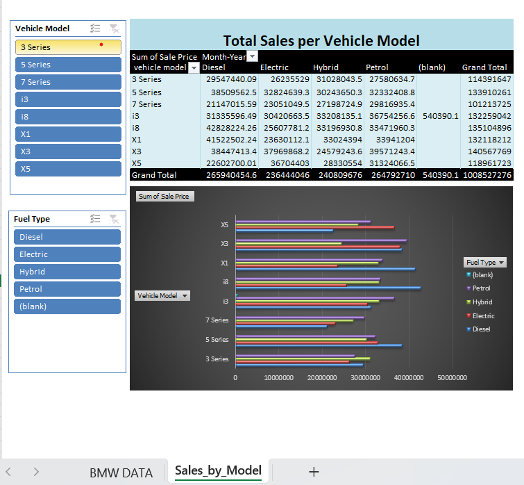

# 🚗 BMW South Africa Sales Analysis

This project uses Excel to analyze BMW vehicle sales in South Africa by model and fuel type over time. It includes pivot tables and charts for visual insights.

## 📊 Project Goals
- Understand which BMW models are selling best in South Africa.
- Compare sales by fuel type: Petrol, Diesel, Electric, Hybrid.
- Identify monthly and yearly sales trends.

## 🛠 Tools Used
- Microsoft Excel (Pivot Tables, Pivot Charts)
- Data Cleaning & Formatting
- Visualization via Charts

## 📈 Sample Visuals

### 🔸 Sales Trend Over Time

### 🔸 Fuel Type Breakdown

> *(These images were exported from the Excel file's charts)*

## 📂 Files in This Repo
- `BMW_South_Africa_Sales_Data.xlsx` – Excel file with data and charts
- `README.md` – This project overview
- `BMW_Excel_trend.png`, `fuel_type_chart.png` – Screenshots of key charts

## 👩🏽‍💻 About Me

**Asemahle Zide**  
📊 Data and Reporting Intern   
🔗 [LinkedIn](https://www.linkedin.com/in/asemahle-zide-201063215/)     
🔗 [GitHub Profile](https://github.com/Asemahlezide22)
